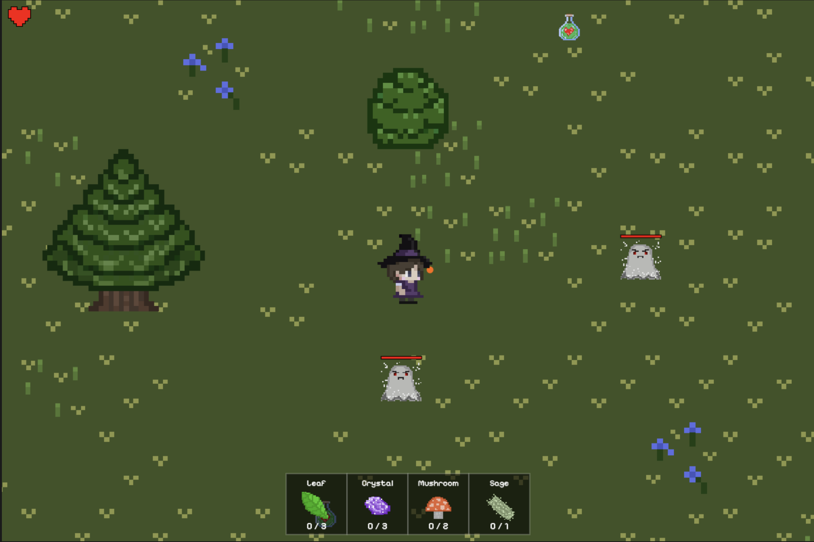
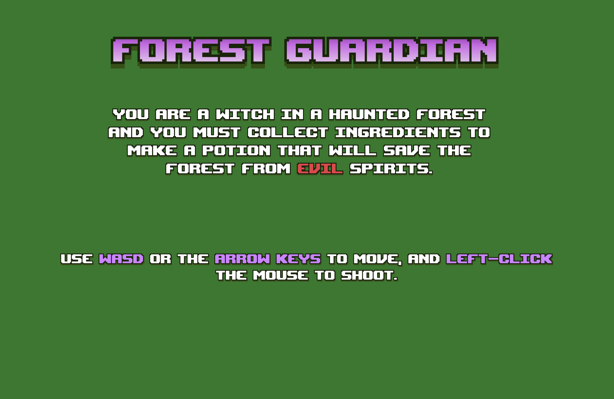
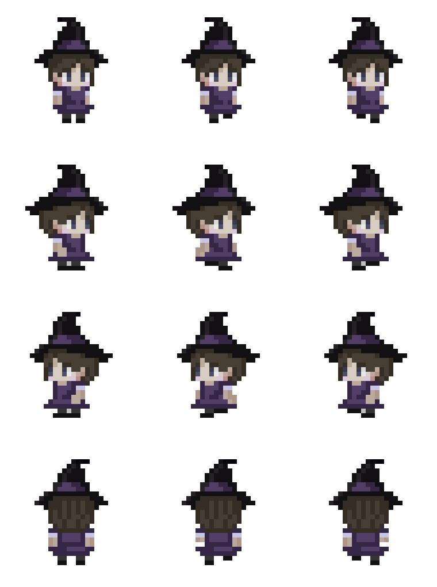
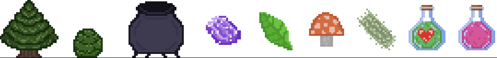

# 🎮 **Forest Guardian** 

> In the 2D adventure game Forest Guardian, you become a witch in a haunted forest. You must avoid or fight evil spirits and collect enough ingredients to make a potion that will protect the forest!
> 

---
## **Play the game!**
https://beeggames.itch.io/forest-guardian

## 📸 **Screenshots**

### Main Gameplay:

  
  
*Figure 1: Example of gameplay in action.*

---

### Menu and UI:

  
  
*Figure 2: Menu and user interface.*

---

## 🎨 **Spritesheets**
Below are the sprites used to create characters and objects in the game:

### Player Character:

  
  
*Figure 3: Player character animations.*

---

### Enemies:

  
  
*Figure 4: Enemy animations.*

---
### Objects:

  
  
*Figure 5: Objects in game.*

